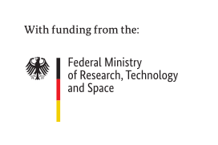

# Interactive Notebooks

Interactive notebooks to explore findings of [KompAKI](https://www.tu-darmstadt.de/kompaki).

## Acknowledgements

This research and development project was partially funded by the German Federal Ministry of Research, Technology and Space (BMFTR) within the “The Future of Value Creation – Research on Production, Services and Work” program (funding number 02L19C150). The respective authors are responsible for the content.

## License

See [LICENSE](LICENSE) for details.
